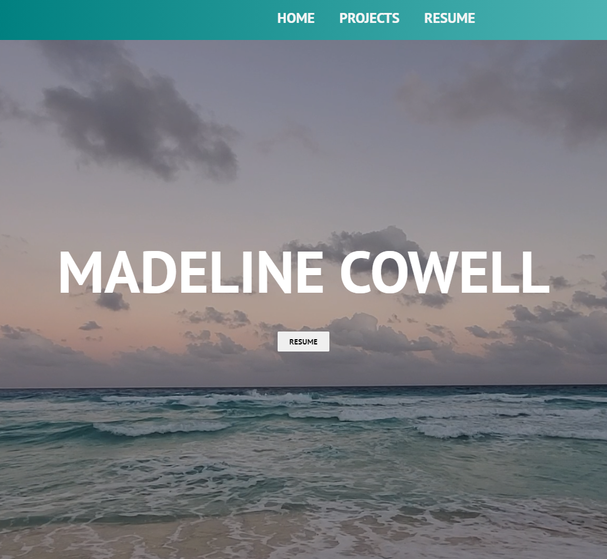
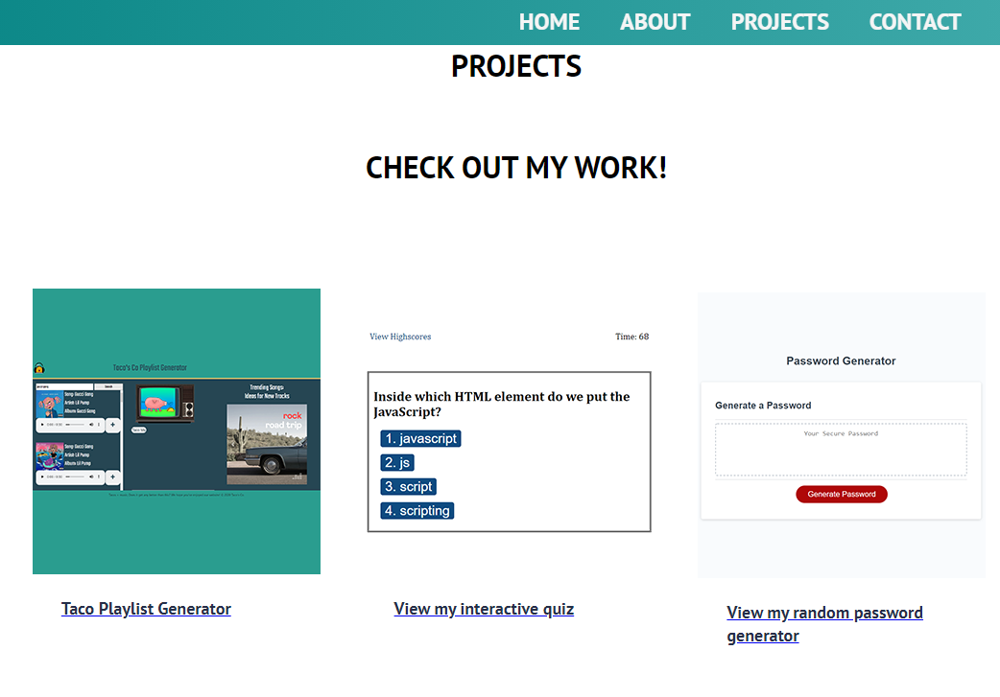
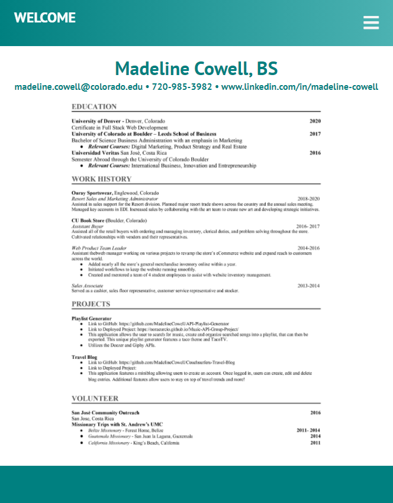
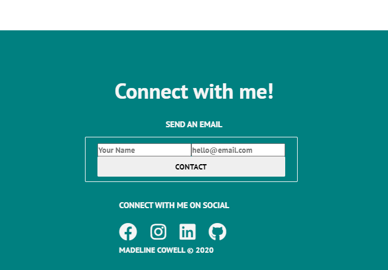

# React Portfolio
As a recent graduate from a Full Stack Web Development course, this website showcases what I've learned. 

### Highlights
1. Features links to GitHub, LinkedIn and my resume.
2. Utilizes JavaScript, React, Express and much more!
3. Simple and clean interface easily allows users to navigate throughout the site.
4. Mobile responsive.

### Website UI Gallery
#### HOME

<!-- #### ABOUT
 -->

#### PROJECTS

<!-- #### CONTACT
 -->

#### RESUME

#### Footer

### Contact

For any questions, comments or suggestions, please contact me at madeline.cowell@colorado.edu

### View more of my work
[Github/MadelineCowell](https://github.com/MadelineCowell)